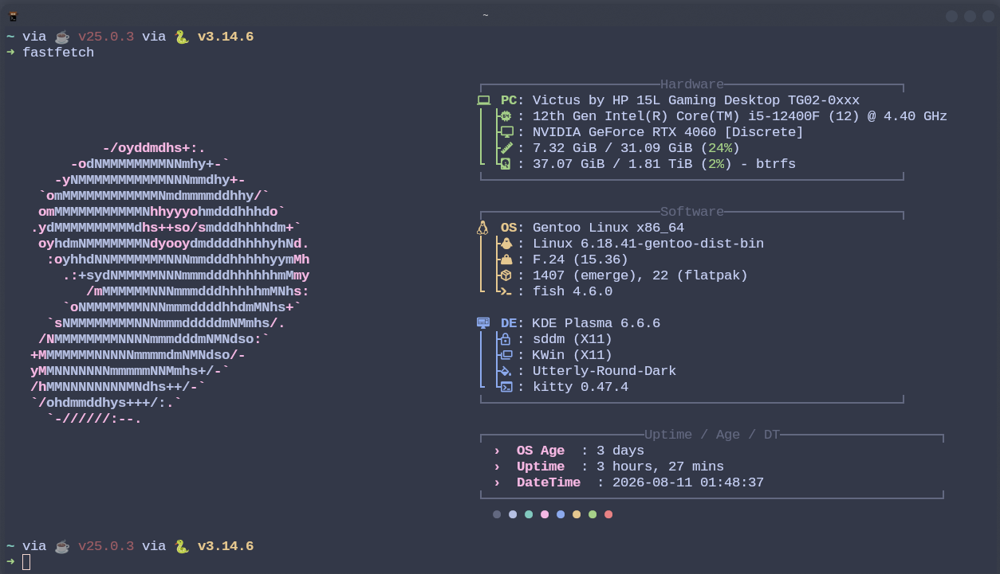

# Dotfiles

My personal dotfiles for my Terminal.

## Configurations

- **Fish** — shell configuration
- **Kitty** — terminal configuration
- **Starship** — shell prompt
- **Fastfetch** — system information
- **Fetch** — system information

## Structure
```text
dotfiles/
├── fastfetch/
├── fetch/
├── fish/
├── kitty/
└── starship.toml
```
## Setup 
```text
git clone https://github.com/o9bo-quit/dotfiles.git
cd ~/dotfiles/
cp fish/config.fish ~/.config/fish/config.fish
cp ./starship.toml ~/.config/starship.toml
cp fastfetch/config.jsonc ~/.config/fastfetch/config.jsonc
cp fetch/config ~/.config/fetch/config 
cp kitty/kitty.conf ~/.config/kitty/kitty.conf
cp kitty/cap-theme.conf ~/.config/kitty/cap-theme.conf
```

